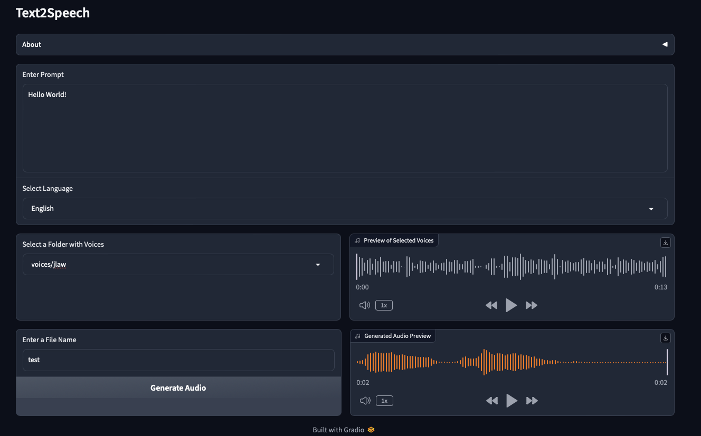

# 🗣️ Text2Speech - A simple text to speech app using Python

This is a simple text to speech app written in Python. It uses [TTS](https://github.com/coqui-ai/TTS) to generate speech from text. To build the web app, I used [Gradio](https://www.gradio.app).
The app is mainly done for my personal use, but I thought it would be nice to share it with others.

## 📝 Features

- Generate speech from text in 16 languages
- Save the generated speech as a WAV file
- Use any recoreded voice as the speaker and convert it to speech in any language
- Very fast interference even on CPU (tested on Apple M1)

## 📷 Screenshots

## 🏗️ Installation

1. Clone this repository
2. Create a new Python 3.11 virtual environment in your preferred way
3. Install the requirements: `pip install -r requirements.txt`
4. Run the installation script: `bash install.sh`
   - This will clone the TTS repository and install the requirements.
5. Run the app: `python app.py`

## 📚 Notes

- You have to provide a `voices` folder, which should contain subfolders with the recorded voices in `.wav` or `.mp3`. If you don't have any recorded voices, you can use [the voices folder](https://github.com/neonbjb/tortoise-tts/tree/main/tortoise/voices) from [Tortoise](https://github.com/neonbjb/tortoise-tts)  (which is also a great TTS Python library).
- The app will save the generated speech in the `generated_audio` folder.